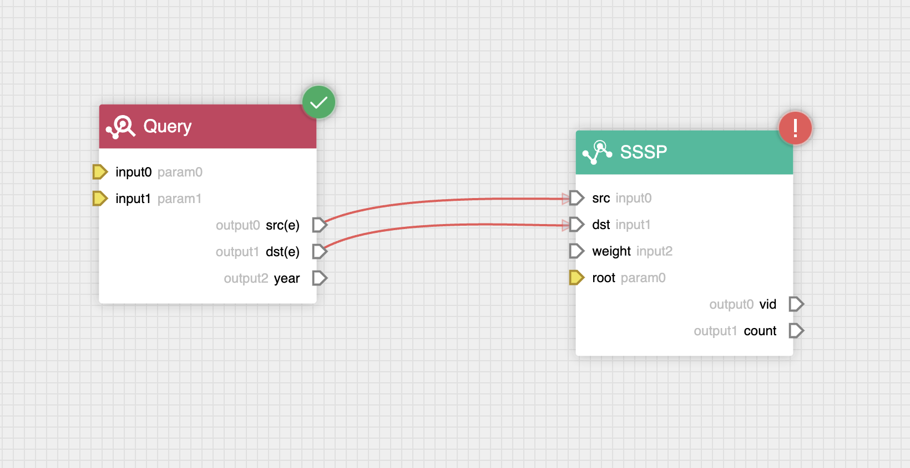
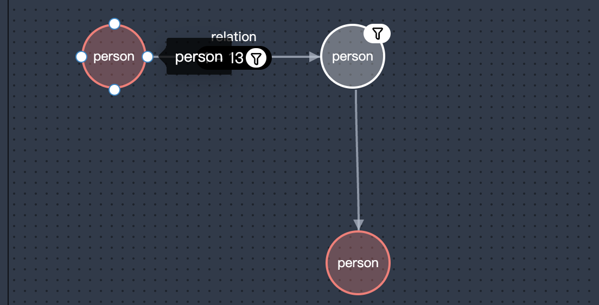
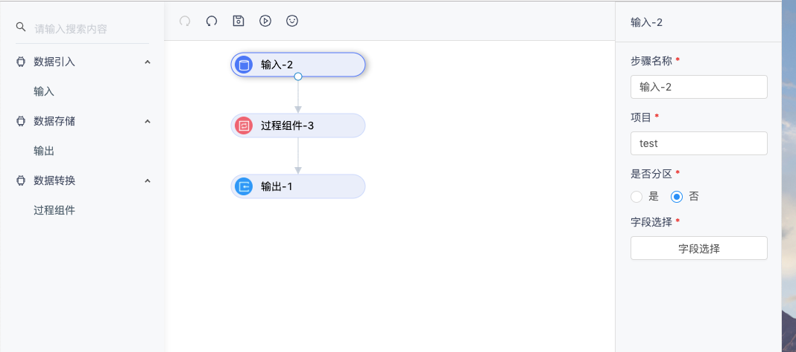

# NebulaGraph veditor

NebulaGraph VEditor is a highly customizable flow chart library, with which you create flow charts, sequence diagrams, workflow, and more.





# Features
- Typescript: Natively TS support
- Customizable: Support SVG, HTML, CSS, Canvas, React/Vue and more to custome node/line shapes
- Minimap: Birdview of given viewport in the diagram
- Shortcuts Keys: undo, redo, copy, paste, select, zoom, pan and more
- Performant: Async/Await pattern enabled high performance of graph loading
 
# Installation
```bash
npm install @vesoft-inc/veditor
```

# demo
```bash
npm run start
```

# Build
```bash
npm run build

# make declaration
npm run makeDts
```

## Quick Start
```typescript
import VEditor from "@vesoft-inc/veditor";

let index = 0;
const editor =  new VEditor({ 
  dom: document.getElementById("root")
});
// add node
function add(){
  editor.graph.node.addNode({
    uuid:index,
    type:"default",// node shape type
    name:"test"+index++,
    x:window.innerWidth*Math.random(),
    y:300*Math.random()
  })
}
for(let x = 0;x<50;x++){
  add();
}
// add line
for(let x = 0;x<10;x++){
  editor.graph.line.addLine({
    from:Math.floor(50*Math.random()),
    to:Math.floor(50*Math.random()),
    fromPoint:1,
    toPoint:0
  })
}
// result
console.log(editor.schema.getData())
```

## Register Shape
You can refer to src/Shape/Nodes, src/Shape/Lines to register your own shape.

```javascript
import VEditor from "@vesoft-inc/veditor";

let index = 0;
const editor =  new VEditor({ dom: document.getElementById("root")});
// add node
function add(){
  editor.graph.node.addNode({
    uuid:index,
    type:"react-svg-node",
    name:"test"+index++,
    x:window.innerWidth*Math.random(),
    y:300*Math.random()
  })
} 
// registe react-svg-node
editor.graph.node.registeNode("react-svg-node", {
  linkPoints: [{ x: 0, y: 0.5 }, { x: 1, y: 0.5 }],
  adsorb: [20, 12],
  render: render: (node: InstanceNode) => {
    const radius = 30;
    // popOver
    node.shape = node.shape ? node.shape : document.createElementNS('http://www.w3.org/2000/svg', 'g');
    ReactDOM.render(
      <>
        <circle className="svg-item-output" r={radius + 2} cx={radius} cy={radius} />
        <circle
          className="svg-item"
          r={radius - 1}
          cx={radius}
          cy={radius}
          style={{
            strokeWidth: 2,
            fill: 'white',
            stroke: 'blue',
          }}
        />
      </>,
      node.shape
    );
    return node.shape;
  },
});
add()
// result data
console.log(editor.schema.getData())
```

# API 
See the declaration file for more details.

# License

Apache 2.0
